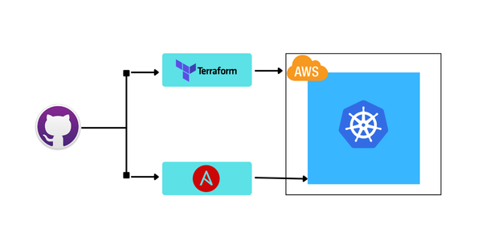

# aws-devops-journey
---

Ce projet open-source documente la mise en place d'une infrastructure DevOps sur AWS.
---

  

    
  

📦 Stack utilisée :
- Terraform (Provisioning AWS)
- Ansible (Configuration automatisée)
- Kubernetes (Déploiement applicatif futur)
- GitHub Actions (CI/CD)

🔗 Suivre le projet : https://github.com/ibrahimbakayoko/aws-devops-journey 
📁 Code semaine par semaine : dans les branches ou sous-dossiers

---

## 📍 Étape actuelle
✅ Semaine 1 : Provisioning AWS via Terraform

## 📌 Objectifs à venir
- Déploiement d’un cluster Kubernetes (k3s sur EC2)
- Supervision (Prometheus, Grafana)
- CI/CD avec GitHub Actions
